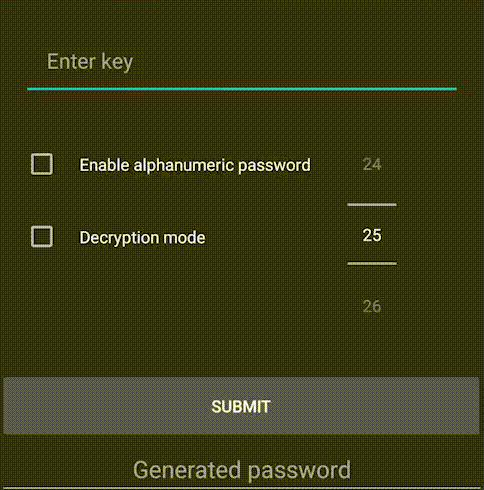

# **KeyCrypt (Android/Java)**

**KeyCrypt** is an Android application developed in **Java** with an XML-based UI. The app provides a secure way to generate passwords based on a user-provided key and password length, while also offering a decryption feature that allows users to recover the original key used for password generation. The app supports clipboard management, input validation, and intuitive error handling, making it a practical tool for anyone looking to manage secure passwords.

---

## **Description**

The **KeyCrypt** app is designed to generate secure passwords using a key-based encryption algorithm and retrieve the original key using a decryption process. Users can toggle between different character sets (alphanumeric or special characters) and manage generated passwords via the clipboard. The encryption algorithm ensures that passwords are unique, difficult to break, and easy to use.

The app consists of two core modes:
1. **Encryption Mode**: Users provide a key and specify the desired password length, generating a secure password by applying character shifts.
2. **Decryption Mode**: Recovers the original key by reversing the character shifts applied during encryption.

### **Key Features**:
- **Password Generation**: Generates passwords using a custom encryption algorithm based on the user’s key.
- **Decryption**: Recovers the original key from a previously generated password.
- **Character Set Selection**: Users can toggle between alphanumeric and special characters.
- **Clipboard Management**: Easily copy the generated password or decrypted key to the clipboard.
- **Input Validation**: Ensures that the key and password meet character set requirements for each mode.
- **Error Handling**: Manages errors with invalid or incomplete inputs, providing user-friendly feedback.

---

## **Demonstration**

Here’s a quick demonstration of the **KeyCrypt** app in action:



This demo showcases the password generation process, where users provide a key, choose the desired password length, and select the character set before generating a secure password. It also demonstrates the clipboard management feature for easy copying and the decryption process for recovering the original key.

---

## **How It Works**

### **Encryption Algorithm**:
- **Key Repetition**: If the provided key is shorter than the desired password length, it is repeated until it matches the length.
- **Character Shift**: Each character in the key is shifted within the selected character set based on its position in the password.
- **Final Character Encoding**: The last character of the password encodes the length of the original key, allowing the decryption process to reconstruct the key.

### **Decryption Process**:
- **Key Length Recovery**: The app reads the last character of the password to determine the length of the original key.
- **Reverse Shifts**: It then applies reverse shifts to recover the original key from the encrypted password.

### **Combinatorial Complexity**:
Using the alphanumeric character set, a password of 10 characters generates 62¹⁰ combinations.

This ensures a vast number of unique password combinations, making them secure against brute-force attacks.

---

## **Requirements**

### **For Regular Users**:
- No requirements needed

### **For Developers**:
To build the project from source, you will need:
- **Android Studio**: Download it from [here](https://developer.android.com/studio).
- **Java Development Kit (JDK)** 8 or higher.
- **Android SDK**: Included with Android Studio.

---

## **Installation and Setup**

### **For All Users**:
1. Download the APK from the [releases page](https://github.com/Glooring/keycrypt-android/releases) or directly using [this link](https://github.com/Glooring/keycrypt-android/releases/download/v1.0.0/keycrypt-v1.0.0-release.zip).
2. Install the APK on your Android device.
3. Open the app and start generating passwords or decrypting keys.
---
### **For Developers**:
1. Clone the repository into a folder named `KeyCrypt`:
   ```bash
   git clone https://github.com/Glooring/keycrypt-android.git KeyCrypt
   ```
2. Open the project in **Android Studio**.
3. Sync the project with Gradle by clicking **File > Sync Project with Gradle Files**.
4. Build and run the app on an Android emulator or physical device.


## **Project Structure**

The project has been organized as follows:

```
KeyCrypt/
│
├── .gradle/                            # Gradle-specific system files (auto-generated during build)
├── .idea/                              # Android Studio project settings and configurations
├── app/                                # Contains the source code and resources of the Android app
├── gradle/                             # Gradle wrapper configuration files
├── media/                              # Contains media assets such as GIFs or images (e.g., demonstration GIF) 
├── release/
│   └── keycrypt-v1.0.apk               # Compiled APK for Android devices (ready for distribution)
├── LICENSE                             # License information for the project
├── README.md                           # Project documentation (this file)
├── build.gradle                        # Main Gradle build configuration for the project
├── gradle.properties                   # Properties for Gradle build system
├── gradlew                             # Unix script to run Gradle tasks without installing Gradle
├── gradlew.bat                         # Windows script to run Gradle tasks without installing Gradle
├── local.properties                    # Local environment-specific settings (e.g., SDK path)
└── settings.gradle                     # Settings for the overall Gradle build configuration
```

---

## **Technologies Used**

- **Android Studio**: 2024.1.1 (Koala)
- **Gradle Version**: 8.7
- **Android Gradle Plugin**: Managed via `libs.versions.toml` (version not specified directly)
- **Java Version**: 1.8 (used for core logic implementation)
- **Kotlin Code Style**: Official (`kotlin.code.style=official`)
- **AndroidX**: Enabled (`android.useAndroidX=true`)
- **Non-Transitive R Class**: Enabled (`android.nonTransitiveRClass=true`)

### Core Components:
- **Java**: Core logic implementation for encryption and decryption.
- **XML**: Used for designing the user interface.
- **Android SDK**: The framework for Android app development.
- **Toast**: Utilized for user feedback through notifications.

---

## **Future Improvements**

- **Additional Character Sets**: Support for more character sets beyond alphanumeric and special characters.
- **Advanced Encryption Algorithms**: Implementation of stronger encryption methods for production-level security.
- **UI Enhancements**: Improve the user interface for better usability and modern design.
- **Biometric Authentication**: Add fingerprint or facial recognition for enhanced security.

---

## **License**

This project is licensed under the **MIT License**. See the `LICENSE` file for more details.
